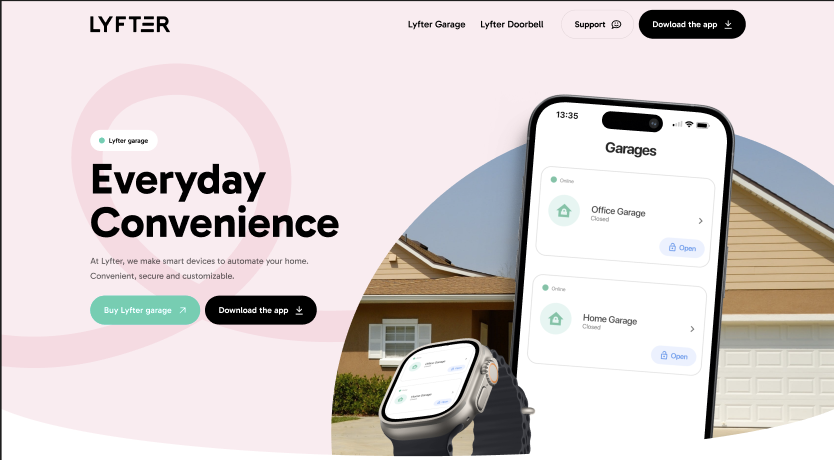

# GarageOpener

## Introduction
This is a (onepage) design created in a WordPress Sage theme,
using Laravel Blade for templating. It also brings modern JavaScript tooling to Wordpress Themes, including CSS Hot Realoading.

## Setup instructions

### Prerequisites

* An Wordpress installation
* (local) LAMPP stack (required for wordpress). You can use for example [Laragon](https://laragon.org/) or [XAMPP](https://www.apachefriends.org/).
* Recent Node install (with NPM, Node Package Manager)
* Recent Composer install (PHP package manager)

### Installation steps

1. Clone repository to `{wordpress installation}/wp-content/themes`.
2. Open the project in a editor like VS Code, Webstorm ect.
3. Open terminal window in editor (or the terminal application on the system itself). Make sure you are in the current directory (project root).
4. Run `npm install` to install all required NPM-packages.
5. Run `composer install` to install all required Composer-packages.
6. If everything went correctly, the website should be available on the wordpress address (like http://localhost/wordpress or http://wordpress.test).
